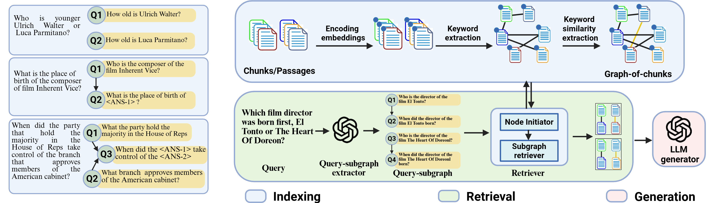
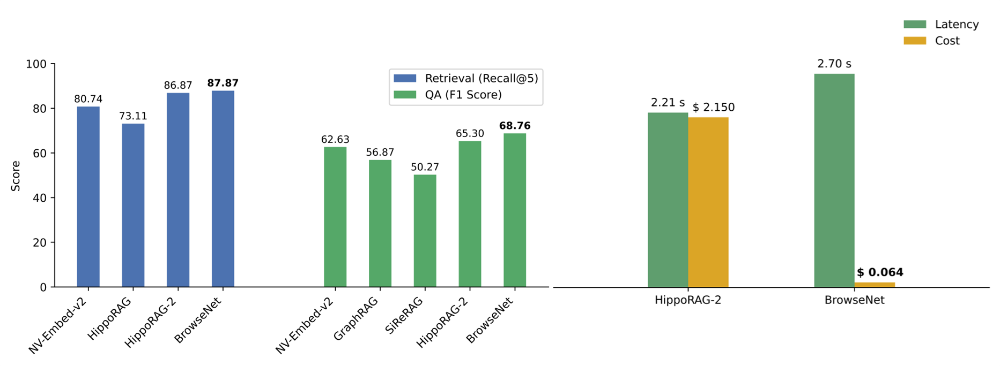

</h1>
<h1 align="center">  BrowseNet: Graph-Based Associative Memory for Contextual Information Retrieval
</h1>

**BrowseNet** is a graph-based associative memory framework for Retrieval-Augmented Generation (RAG) that decomposes multi-hop queries into a directed acyclic graph (DAG), termed a query-subgraph, and traverses a Graph-of-Chunks to retrieve structured, reasoning-aligned context for LLMs.


<p align="center">
  <b>Figure 1:</b> BrowseNet overview.
</p>

BrowseNet achieves **state-of-the-art** performance while being highly **cost-efficient**, reducing LLM costs by ~33× compared to the previous SOTA, HippoRAG-2, without a significant latency trade-off. This makes BrowseNet well-suited for large-scale, cost-sensitive RAG scenarios.

<p align="center">
  
</p>

<p align="center">
  <b>Figure 2:</b>
  (a) Average retrieval performance across the 2WikiMQA, HotpotQA, and MuSiQue datasets.
  (b) Latency and cost comparison between BrowseNet and HippoRAG-2.
</p>

> [!NOTE]
> Latency is measured as Average Time Per Query (ATPQ) over 50 sampled questions from the MuSiQue dataset and may vary depending on system hardware, runtime environment, and configuration settings. Cost analysis is based on the HotpotQA benchmark and reflects the full pipeline cost using *gpt-4o-mini* in both systems, computed with OpenAI’s API pricing ($0.15 per 1M input tokens and $0.6 per 1M output tokens, as of Sept 24, 2025).

## Environment Setup

Set up the Conda environment and install the required dependencies:

```shell
conda env create -f environment.yml
```

To enable semantic keyword matching, ColBERTv2 is required. Download the pre-trained [checkpoint](https://downloads.cs.stanford.edu/nlp/data/colbert/colbertv2/colbertv2.0.tar.gz), extract it into `src/indexer/exp/`

```shell
cd src/indexer/exp
wget https://downloads.cs.stanford.edu/nlp/data/colbert/colbertv2/colbertv2.0.tar.gz
tar -xvzf colbertv2.0.tar.gz
```
## Dataset Format
All benchmark datasets used in this study are available under `./datasets/`.

To evaluate BrowseNet on a new dataset, follow the steps below.

### 1️⃣ Create Dataset Directory
Create a new folder under `./datasets/ ` named `./datasets/<dataset_name>/`.  
The folder name *must match the dataset name*.

### 2️⃣ Required Files
Upload the following files to the dataset folder:

- `corpus.json` — document corpus  
- `questions.json` — multi-hop queries  

### 3️⃣ `corpus.json` Format
Each entry represents a passage in the corpus.

```json
[
  {
    "title": "<title of the passage>",
    "text": "<passage>"
  }
]
```
### 4️⃣ `questions.json` Format
Each entry corresponds to a multi-hop query.  
The fields *`gold_ids`*, *`edge_list`*, and *`answer`* are *optional* and are used for evaluating retrieval, Graph-of-Chunks construction, and answer generation stages respectively.

```json
[
  {
    "question": "<multi-hop query>",
    "gold_ids": "<list of corpus indices required to answer the question>",
    "edge_list": "<list of edges in the query-subgraph>",
    "answer": "<ground-truth answer>"
  }
]
```

## ⚙️ Environment Variables

All parameters must be defined as environment variables. A sample `.env` file is provided in the repository.

### 🔑 API Keys
- `OPENAI_API_KEY` — API key for OpenAI-based models
- `DEEPSEEK_API_KEY` — API key for DeepSeek models (optional)

### 🖥️ System Configuration
- `DEVICE` — Device for loading encoder models (`cuda` or `cpu`)

### 🕸️ Graph-of-Chunks Construction
- `COLBERT_THRESHOLD` — Threshold for synonym matching using ColBERTv2 (default: `0.9`)

### 📊 Dataset & Retrieval
- `DATASET` — Dataset name (`2wikimqa`, `hotpotqa`, `musique`)
- `RETRIEVAL_METHOD` — Retrieval strategy (`browsenet` or `naiverag`)
- `N_SUBGRAPHS` — Number of subgraphs retrieved per query
- `N_CHUNKS` — Number of chunks used for answer generation (default: `5`)
- `ALPHA` — Sparse retriever weight in hybrid retrieval (`0–1`, set to `0` in this study)

### 🧠 Models
- `NER_MODEL` — Named entity recognition model (`gliner` or `gpt-4o`)
- `SEM_MODEL` — Dense embedding model (`miniLM`, `stella`, `nvembedv2`, `granite`, `qwen2`)
- `SUBQUERY_MODEL` — LLM for query decomposition (`gpt-4o`, `o4-mini`, `deepseek-reasoner`)
- `LLM` — LLM provider (`openai` or `deepseek`)
- `MODEL` — LLM variant for QA (`gpt-4o`, `gpt-3.5-turbo`)
---

Once all environment variables are configured, running `main.py` will index the corpus, perform retrieval, and generate answers for the selected dataset.
